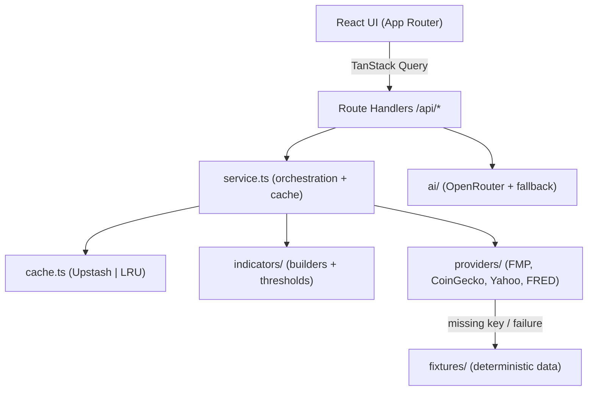

# Fundamental Analysis Dashboard

A production-ready dashboard for exploring the **top 21 fundamental indicators**
of stocks, market indexes and the top cryptocurrencies — each annotated with
**AI-generated explanations** powered by OpenRouter.

Pick an asset, and the app fetches its fundamentals, classifies each indicator
as bullish / neutral / bearish, renders an AI brief, and shows a macro sidebar.

> **Data is for informational purposes only and is not financial advice.**
>
> _Screenshots placeholder — add `docs/screenshot-light.png` and
> `docs/screenshot-dark.png` once deployed._

---

## Highlights

- **Next.js 16 / React 19 / App Router** with strict TypeScript (no `any`).
- **21 fundamental indicators** for stocks & indexes; universal indicators for
  crypto, each with sentiment derived from explicit thresholds.
- **AI briefs** via OpenRouter with a deterministic local fallback.
- **Resilient by design**: every provider validates responses with **Zod** and
  falls back to deterministic fixtures, so the app (and CI/E2E) runs with **zero
  API keys configured**.
- **Caching**: Upstash Redis when configured, in-memory LRU otherwise.
- **Quality gates**: ESLint (strict) + Prettier + Vitest (>70% coverage,
  100% on thresholds) + Playwright smoke test + GitHub Actions CI.
- **Accessible, responsive, dark-mode-first** UI built on Tailwind v4 +
  shadcn/ui primitives.

---

## Architecture



- **`src/lib/providers`** — one module per data source. Each returns a
  `Result<T, AppError>` discriminated union, validates payloads with Zod, and
  degrades to fixtures.
- **`src/lib/indicators`** — `definitions.ts` (metadata), `thresholds.ts`
  (sentiment rules, 100% tested), and `stock.ts` / `crypto.ts` builders.
- **`src/lib/service.ts`** — turns a symbol into an `AssetSnapshot` and
  `IndicatorSet`, with 5-minute caching.
- **`src/lib/ai`** — OpenRouter client (`openrouter.ts`) + prompt builder, with
  a deterministic offline brief and 6-hour caching.

---

## Indicators

**Stocks / Indexes (1–20):** P/E, P/B, P/S, PEG, EV/EBITDA, Dividend Yield,
Payout Ratio, EPS, ROE, ROA, Net Profit Margin, Current Ratio, Quick Ratio,
Debt-to-Equity, Interest Coverage, Free Cash Flow, Revenue Growth YoY, Market
Cap, Beta, Asset Turnover.

**Crypto (universal):** Market Cap, Volatility 30d, NVT Ratio. Stock-only
fundamentals are skipped gracefully.

Each indicator carries `value`, `unit`, `sentiment`, and an optional
`sectorAverage` / `historicalRange`.

---

## Getting started

```bash
# 1. Install
npm install

# 2. Configure environment (all keys optional — see below)
cp .env.example .env.local

# 3. Run
npm run dev        # http://localhost:3000
```

The app runs fully **without any API keys** thanks to the fixture fallback. Add
keys to `.env.local` to switch to live data.

### Environment variables

| Variable                   | Required | Purpose                                            |
| -------------------------- | -------- | -------------------------------------------------- |
| `OPENROUTER_API_KEY`       | optional | AI briefs (falls back to local brief)              |
| `OPENROUTER_MODEL`         | optional | Model id (default `anthropic/claude-3.5-haiku`)    |
| `FMP_API_KEY`              | optional | Stock fundamentals (falls back to fixtures)        |
| `COINGECKO_API_KEY`        | optional | Crypto data (falls back to fixtures)               |
| `FRED_API_KEY`             | optional | Macro sidebar (falls back to fixtures)             |
| `FINNHUB_API_KEY`          | optional | News feed + weighting (falls back to fixtures)     |
| `UPSTASH_REDIS_REST_URL`   | optional | Redis cache (falls back to in-memory LRU)          |
| `UPSTASH_REDIS_REST_TOKEN` | optional | Redis cache token                                  |
| `NEXT_PUBLIC_APP_URL`      | optional | Public app URL (default `http://localhost:3000`)   |
| `USE_FIXTURES`             | optional | Set to `1` to force fixtures everywhere (E2E/demo) |

Values are validated with Zod at startup (`src/lib/env.ts`); malformed values
fail fast.

### API key acquisition

- **OpenRouter** — <https://openrouter.ai/keys>
- **Financial Modeling Prep** — <https://site.financialmodelingprep.com/developer/docs>
- **CoinGecko** — <https://www.coingecko.com/en/api/pricing>
- **FRED** — <https://fredaccount.stlouisfed.org/apikeys>
- **Upstash Redis** — <https://console.upstash.com/>

---

## Scripts

| Script                 | Description                                 |
| ---------------------- | ------------------------------------------- |
| `npm run dev`          | Start the dev server                        |
| `npm run build`        | Production build                            |
| `npm run start`        | Serve the production build                  |
| `npm run lint`         | ESLint (zero warnings allowed)              |
| `npm run lint:fix`     | ESLint with autofix                         |
| `npm run format`       | Prettier write                              |
| `npm run format:check` | Prettier check                              |
| `npm run typecheck`    | `tsc --noEmit`                              |
| `npm run test`         | Vitest unit tests with coverage             |
| `npm run test:watch`   | Vitest watch mode                           |
| `npm run test:e2e`     | Playwright smoke test (builds + serves app) |
| `npm run check`        | lint + format:check + typecheck + test      |
| `npm run check:apis`   | Live health-check of configured API keys    |
| `npm run analyze`      | Bundle analysis (`@next/bundle-analyzer`)   |

---

## Testing

- **Unit (Vitest):** `npm run test`. `thresholds.ts` is covered 100%; the
  overall `src/lib` coverage threshold is 70% across lines/branches/functions.
  Providers are tested for both success (live, mocked `fetch`) and failure
  (fixture fallback) paths; Zod schemas are tested with valid and invalid input.
- **E2E (Playwright):** `npm run test:e2e` loads the app, selects AAPL, asserts
  ≥15 indicator cards render, confirms the AI brief populates, and asserts no
  console errors.

---

## Data providers, free-tier limits & alternatives

All providers are optional (fixtures fill in). Run `npm run check:apis` to verify
your configured keys live (it never prints secrets).

| Provider                     | Used for              | Free-tier limit                                                                              | Notes / better free option                                                                                                           |
| ---------------------------- | --------------------- | -------------------------------------------------------------------------------------------- | ------------------------------------------------------------------------------------------------------------------------------------ |
| **FMP** (`/stable`)          | Stock fundamentals    | 250 requests/day, US EOD, ~5y history                                                        | Legacy `/api/v3` is retired for new keys — this app uses `/stable`. Some statement endpoints are plan-gated (they degrade to N/A).   |
| **CoinGecko** (Demo)         | Crypto market data    | 100 calls/min, 10,000/month                                                                  | Plenty for this app (2–3 calls/coin, cached 5 min).                                                                                  |
| **FRED**                     | Macro sidebar         | 120 requests/min, no daily cap, fully free                                                   | Best-in-class free; uses `fred/series/observations` (v1) which is correct for single series.                                         |
| **Yahoo** (`yahoo-finance2`) | Index quotes          | Unofficial, no key; occasional `429`                                                         | Used only for indexes; falls back to fixtures on failure.                                                                            |
| **OpenRouter**               | AI brief              | Paid per-token; **free `:free` models** at 20 req/min (50/day, or 1000/day with ≥10 credits) | **Tip:** set `OPENROUTER_MODEL` to a free model (e.g. `meta-llama/llama-3.3-70b-instruct:free`) to avoid spend.                      |
| **Finnhub**                  | News feed + weighting | **60 calls/min** free, US company news                                                       | Most generous free news-by-symbol API. Also offers basic fundamentals — a strong free alternative to FMP if you hit the 250/day cap. |

Other free alternatives considered: **Twelve Data** (800 req/day, strong for
prices), **Alpha Vantage** (News & Sentiment API, but only 25 req/day),
**Marketaux** (entity-centric news, 100 req/day).

## News & event weighting

When you select an asset, the app loads recent headlines (Finnhub for stocks;
category news for indexes/crypto) and runs them through a deterministic
weighting engine (`src/lib/news/classify.ts`):

1. **Event classification** — each headline is tagged with a market-event type
   (M&A, leadership change, legal, regulatory, earnings, guidance, layoffs,
   analyst, partnership, dividend, buyback, product) via keyword rules, each
   carrying an importance **weight** and a default polarity.
2. **Sentiment** — positive/negative keyword scoring overrides the event's
   default polarity when present.
3. **Recency decay** — newer headlines weigh more (linear decay over 21 days,
   floored at 0.15).
4. **News Index** — a weighted average of signed impacts, normalized to a
   **−100…+100** index with a positive/neutral/negative label, shown in the
   News panel.
5. **AI input** — the news index and the **top-20 weighted headline titles** are
   fed into the AI brief prompt so the summary reflects current events.

## Options, futures & order books

Beyond fundamentals, the dashboard surfaces market-structure data (all free):

- **Options chain** (stocks/indexes) via `yahoo-finance2` — expiration picker,
  put/call ratio, an **IV-smile chart**, and a calls/strike/puts table.
  `/api/options/[symbol]`.
- **Crypto order book** (L2 depth) via Binance's public API — bid/ask ladder
  with depth bars, spread and **depth imbalance**, polled live.
  `/api/orderbook/[symbol]` (crypto only).
- **Futures watchlist** (S&P, Nasdaq, Crude, Gold, …) via `yahoo-finance2`
  quotes. `/api/futures`.

Stock/index L2 order books are intentionally omitted — they require paid
exchange feeds and have no viable free source. Each panel validates with Zod and
falls back to deterministic fixtures when the upstream is unreachable.

The **Sentiment distribution** chart is category- and conviction-weighted: each
indicator's contribution scales with its category importance and how far its
value sits past the bullish/bearish threshold; unavailable indicators are
reported separately.

## Analysis & interpretation

- **Trailing returns** — the header shows **YTD / 1Y / 3Y / 5Y** price returns
  (computed from Yahoo monthly history; `/api/performance/[symbol]`).
- **Macro interpretation** — each macro metric is color-coded for risk assets
  (green = supportive, red = headwind) with a tooltip explaining the metric and
  the current reading (e.g. high 10Y yields = valuation headwind).
- **AI trade recommendation** — the AI brief analyzes fundamentals + news and
  proposes a **long / short / avoid** stance over a **3–24 month** horizon, a
  **hedge** idea (e.g. protective put), and an **illustrative max gain/loss on a
  hypothetical €10,000 position**. A deterministic heuristic fills in when no AI
  key is set. This is educational analysis, **not financial advice**.

## Deployment (Vercel)

[](https://vercel.com/new)

1. Import the repository into Vercel.
2. Add any environment variables you want (all optional).
3. Deploy — the default framework preset (Next.js) requires no extra config.

For Upstash caching in production, add `UPSTASH_REDIS_REST_URL` and
`UPSTASH_REDIS_REST_TOKEN`.

---

## Contributing

1. Branch from `main`.
2. Commit using **Conventional Commits** (enforced by commitlint).
3. `npm run check` must pass; Husky runs lint-staged on pre-commit.
4. Open a PR — CI runs lint, format, typecheck, tests, build and the E2E smoke
   test.

---

## Notes & deliberate deviations from the original spec

- **Next.js 16** (not 15): `create-next-app@latest` installs Next 16, a
  backward-compatible superset (App Router, React 19, Tailwind v4). ESLint 9
  flat config is used instead of a legacy `.eslintrc.cjs`.
- **Optional env keys:** the spec described keys as required; to keep CI and the
  E2E test hermetic, keys are optional and validated, with fixture/LRU
  fallbacks (matching the spec's own "fallback" requirements).
- **AI brief transport:** returned as validated JSON (summary + per-indicator
  notes) rather than a token stream, for testability and robust caching.
- **Asset selector** uses a curated, debounced, keyboard-navigable list that
  includes the top-5 crypto fallback; live CoinGecko ranking is available
  server-side via `getTopCryptos()`.

---

## License

MIT © Contributors. See [LICENSE](./LICENSE).
