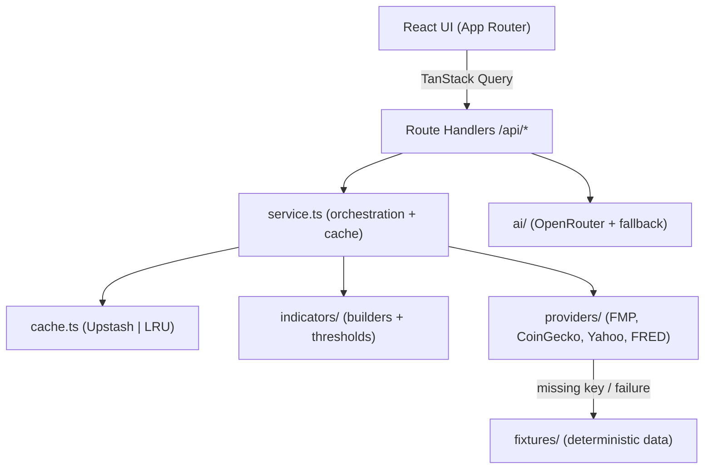

# Fundamental Analysis Dashboard

A production-ready dashboard for exploring the **top 21 fundamental indicators**
of stocks, market indexes and the top cryptocurrencies — each annotated with
**AI-generated explanations** powered by OpenRouter.

Pick an asset, and the app fetches its fundamentals, classifies each indicator
as bullish / neutral / bearish, renders an AI brief, and shows a macro sidebar.

> **Data is for informational purposes only and is not financial advice.**
>
> _Screenshots placeholder — add `docs/screenshot-light.png` and
> `docs/screenshot-dark.png` once deployed._

---

## Highlights

- **Next.js 16 / React 19 / App Router** with strict TypeScript (no `any`).
- **21 fundamental indicators** for stocks & indexes; universal indicators for
  crypto, each with sentiment derived from explicit thresholds.
- **AI briefs** via OpenRouter with a deterministic local fallback.
- **Resilient by design**: every provider validates responses with **Zod** and
  falls back to deterministic fixtures, so the app (and CI/E2E) runs with **zero
  API keys configured**.
- **Caching**: Upstash Redis when configured, in-memory LRU otherwise.
- **Quality gates**: ESLint (strict) + Prettier + Vitest (>70% coverage,
  100% on thresholds) + Playwright smoke test + GitHub Actions CI.
- **Accessible, responsive, dark-mode-first** UI built on Tailwind v4 +
  shadcn/ui primitives.

---

## Architecture



- **`src/lib/providers`** — one module per data source. Each returns a
  `Result<T, AppError>` discriminated union, validates payloads with Zod, and
  degrades to fixtures.
- **`src/lib/indicators`** — `definitions.ts` (metadata), `thresholds.ts`
  (sentiment rules, 100% tested), and `stock.ts` / `crypto.ts` builders.
- **`src/lib/service.ts`** — turns a symbol into an `AssetSnapshot` and
  `IndicatorSet`, with 5-minute caching.
- **`src/lib/ai`** — OpenRouter client (`openrouter.ts`) + prompt builder, with
  a deterministic offline brief and 6-hour caching.

---

## Indicators

**Stocks / Indexes (1–20):** P/E, P/B, P/S, PEG, EV/EBITDA, Dividend Yield,
Payout Ratio, EPS, ROE, ROA, Net Profit Margin, Current Ratio, Quick Ratio,
Debt-to-Equity, Interest Coverage, Free Cash Flow, Revenue Growth YoY, Market
Cap, Beta, Asset Turnover.

**Crypto (universal):** Market Cap, Volatility 30d, NVT Ratio. Stock-only
fundamentals are skipped gracefully.

Each indicator carries `value`, `unit`, `sentiment`, and an optional
`sectorAverage` / `historicalRange`.

---

## Getting started

```bash
# 1. Install
npm install

# 2. Configure environment (all keys optional — see below)
cp .env.example .env.local

# 3. Run
npm run dev        # http://localhost:3000
```

The app runs fully **without any API keys** thanks to the fixture fallback. Add
keys to `.env.local` to switch to live data.

### Environment variables

| Variable                   | Required | Purpose                                            |
| -------------------------- | -------- | -------------------------------------------------- |
| `OPENROUTER_API_KEY`       | optional | AI briefs (falls back to local brief)              |
| `OPENROUTER_MODEL`         | optional | Model id (default `anthropic/claude-3.5-haiku`)    |
| `FMP_API_KEY`              | optional | Stock fundamentals (falls back to fixtures)        |
| `COINGECKO_API_KEY`        | optional | Crypto data (falls back to fixtures)               |
| `FRED_API_KEY`             | optional | Macro sidebar (falls back to fixtures)             |
| `FINNHUB_API_KEY`          | optional | News feed + weighting (falls back to fixtures)     |
| `UPSTASH_REDIS_REST_URL`   | optional | Redis cache (falls back to in-memory LRU)          |
| `UPSTASH_REDIS_REST_TOKEN` | optional | Redis cache token                                  |
| `NEXT_PUBLIC_APP_URL`      | optional | Public app URL (default `http://localhost:3000`)   |
| `USE_FIXTURES`             | optional | Set to `1` to force fixtures everywhere (E2E/demo) |

Values are validated with Zod at startup (`src/lib/env.ts`); malformed values
fail fast.

### API key acquisition

- **OpenRouter** — <https://openrouter.ai/keys>
- **Financial Modeling Prep** — <https://site.financialmodelingprep.com/developer/docs>
- **CoinGecko** — <https://www.coingecko.com/en/api/pricing>
- **FRED** — <https://fredaccount.stlouisfed.org/apikeys>
- **Upstash Redis** — <https://console.upstash.com/>

---

## Scripts

| Script                   | Description                                  |
| ------------------------ | -------------------------------------------- |
| `npm run dev`            | Start the dev server                         |
| `npm run build`          | Production build                             |
| `npm run start`          | Serve the production build                   |
| `npm run lint`           | ESLint (zero warnings allowed)               |
| `npm run lint:fix`       | ESLint with autofix                          |
| `npm run format`         | Prettier write                               |
| `npm run format:check`   | Prettier check                               |
| `npm run typecheck`      | `tsc --noEmit`                               |
| `npm run test`           | Vitest unit tests with coverage              |
| `npm run test:watch`     | Vitest watch mode                            |
| `npm run test:e2e`       | Playwright smoke test (builds + serves app)  |
| `npm run check`          | lint + format:check + typecheck + test       |
| `npm run check:apis`     | Live health-check of configured API keys     |
| `npm run hedge:scan`     | Trigger a HedgeScope scan (needs the server) |
| `npm run hedge:backfill` | Rebuild ~252 days of history (see below)     |
| `npm run hedge:health`   | Schema version, last scan, IV-rank readiness |
| `npm run analyze`        | Bundle analysis (`@next/bundle-analyzer`)    |

---

## Testing

- **Unit (Vitest):** `npm run test`. `thresholds.ts` is covered 100%; the
  overall `src/lib` coverage threshold is 70% across lines/branches/functions.
  Providers are tested for both success (live, mocked `fetch`) and failure
  (fixture fallback) paths; Zod schemas are tested with valid and invalid input.
- **E2E (Playwright):** `npm run test:e2e` loads the app, selects AAPL, asserts
  ≥15 indicator cards render, confirms the AI brief populates, and asserts no
  console errors.

---

## Data providers, free-tier limits & alternatives

All providers are optional (fixtures fill in). Run `npm run check:apis` to verify
your configured keys live (it never prints secrets).

| Provider                     | Used for              | Free-tier limit                                                                              | Notes / better free option                                                                                                           |
| ---------------------------- | --------------------- | -------------------------------------------------------------------------------------------- | ------------------------------------------------------------------------------------------------------------------------------------ |
| **FMP** (`/stable`)          | Stock fundamentals    | 250 requests/day, US EOD, ~5y history                                                        | Legacy `/api/v3` is retired for new keys — this app uses `/stable`. Some statement endpoints are plan-gated (they degrade to N/A).   |
| **CoinGecko** (Demo)         | Crypto market data    | 100 calls/min, 10,000/month                                                                  | Plenty for this app (2–3 calls/coin, cached 5 min).                                                                                  |
| **FRED**                     | Macro sidebar         | 120 requests/min, no daily cap, fully free                                                   | Best-in-class free; uses `fred/series/observations` (v1) which is correct for single series.                                         |
| **Yahoo** (`yahoo-finance2`) | Index quotes          | Unofficial, no key; occasional `429`                                                         | Used only for indexes; falls back to fixtures on failure.                                                                            |
| **OpenRouter**               | AI brief              | Paid per-token; **free `:free` models** at 20 req/min (50/day, or 1000/day with ≥10 credits) | **Tip:** set `OPENROUTER_MODEL` to a free model (e.g. `meta-llama/llama-3.3-70b-instruct:free`) to avoid spend.                      |
| **Finnhub**                  | News feed + weighting | **60 calls/min** free, US company news                                                       | Most generous free news-by-symbol API. Also offers basic fundamentals — a strong free alternative to FMP if you hit the 250/day cap. |

Other free alternatives considered: **Twelve Data** (800 req/day, strong for
prices), **Alpha Vantage** (News & Sentiment API, but only 25 req/day),
**Marketaux** (entity-centric news, 100 req/day).

## News & event weighting

When you select an asset, the app loads recent headlines (Finnhub for stocks;
category news for indexes/crypto) and runs them through a deterministic
weighting engine (`src/lib/news/classify.ts`):

1. **Event classification** — each headline is tagged with a market-event type
   (M&A, leadership change, legal, regulatory, earnings, guidance, layoffs,
   analyst, partnership, dividend, buyback, product) via keyword rules, each
   carrying an importance **weight** and a default polarity.
2. **Sentiment** — positive/negative keyword scoring overrides the event's
   default polarity when present.
3. **Recency decay** — newer headlines weigh more (linear decay over 21 days,
   floored at 0.15).
4. **News Index** — a weighted average of signed impacts, normalized to a
   **−100…+100** index with a positive/neutral/negative label, shown in the
   News panel.
5. **AI input** — the news index and the **top-20 weighted headline titles** are
   fed into the AI brief prompt so the summary reflects current events.

## Options, futures & order books

Beyond fundamentals, the dashboard surfaces market-structure data (all free):

- **Options chain** (stocks/indexes) via `yahoo-finance2` — expiration picker,
  put/call ratio, an **IV-smile chart**, and a calls/strike/puts table.
  `/api/options/[symbol]`.
- **Crypto order book** (L2 depth) via Binance's public API — bid/ask ladder
  with depth bars, spread and **depth imbalance**, polled live.
  `/api/orderbook/[symbol]` (crypto only).
- **Futures watchlist** (S&P, Nasdaq, Crude, Gold, …) via `yahoo-finance2`
  quotes. `/api/futures`.

Stock/index L2 order books are intentionally omitted — they require paid
exchange feeds and have no viable free source. Each panel validates with Zod and
falls back to deterministic fixtures when the upstream is unreachable.

The **Sentiment distribution** chart is category- and conviction-weighted: each
indicator's contribution scales with its category importance and how far its
value sits past the bullish/bearish threshold; unavailable indicators are
reported separately.

## Analysis & interpretation

- **Trailing returns** — the header shows **YTD / 1Y / 3Y / 5Y** price returns
  (computed from Yahoo monthly history; `/api/performance/[symbol]`).
- **Macro interpretation** — each macro metric is color-coded for risk assets
  (green = supportive, red = headwind) with a tooltip explaining the metric and
  the current reading (e.g. high 10Y yields = valuation headwind).
- **AI trade recommendation** — the AI brief analyzes fundamentals + news and
  proposes a **long / short / avoid** stance over a **3–24 month** horizon, a
  **hedge** idea (e.g. protective put), and an **illustrative max gain/loss on a
  hypothetical €10,000 position**. A deterministic heuristic fills in when no AI
  key is set. This is educational analysis, **not financial advice**.

## HedgeScope (`/hedge`)

An options-market monitoring surface that scans a universe of tickers on a
schedule and surfaces hedging setups. It lives alongside `/` and `/chart` in the
same server, reusing this app's providers, cache, AI layer and deploy pipeline.

Everything non-secret is configured in **`hedge.config.yaml`** at the repo root —
ticker universe, scan schedule, tenors, thresholds, ratio pairs. It is
Zod-validated at startup: a malformed value fails the boot loudly rather than
silently disabling a scanner. Compose bind-mounts it read-only, so you can edit
it and restart without a rebuild. Secrets stay in `.env`.

### ⚠️ The volume — read this before you next prune

**IV rank needs 252 trading days of accumulated history, and there is no upstream
to re-download it from.** HedgeScope therefore introduces the first piece of real
persistence in this stack: a SQLite database on the named `hedge-data` volume.

Until now the stack had **no volumes at all**, so `docker system prune --volumes`
was harmless here and you may well have it in your muscle memory. It is not
harmless any more:

```bash
docker system prune --volumes     # ⚠️ DESTROYS the IV history
docker compose down -v            # ⚠️ DESTROYS the IV history
```

Losing it is not fatal — nothing crashes — but IV rank silently reverts to a
**realized-volatility proxy** and stays that way for months while the series
refills. The dashboard labels that state explicitly (see below) rather than
quietly serving degraded numbers.

To back it up:

```bash
docker compose exec web sh -c 'sqlite3 /data/hedge.db ".backup /tmp/b.db"' \
  && docker compose cp web:/tmp/b.db ./hedge-backup.db
```

### Storage choice: `node:sqlite`, not `better-sqlite3`

The database uses Node's **built-in** `node:sqlite` (available unflagged on the
image's Node 22). `better-sqlite3` is the more common pick and is equally
synchronous, so it buys nothing on performance — but it is a **native addon**,
which would mean adding `python3`/`make`/`g++` to the Docker build stage and
depending on an arm64 prebuild at every Node upgrade. The built-in needs none of
that. It is still marked experimental, so the server prints one
`ExperimentalWarning` at boot; that is expected. `src/lib/hedge/db/client.ts`
wraps it behind a small interface, so switching drivers later is a one-file
change.

### VRP: the number that says whether hedging is _actually_ cheap

```text
VRP = ATM_IV_30d − EWMA_realized_vol        (both in vol points)
```

**VRP is not a second opinion on IV rank, and the two routinely disagree.** IV
rank asks _"cheap versus its own history?"_. VRP asks _"cheap versus what
volatility is actually doing?"_. A name can sit in the 10th percentile of its own
IV range while realized vol runs **above** implied — options that look like a
bargain historically and are in fact underpricing reality. Both are displayed;
neither replaces the other.

From a live run: AAPL showed 30-day implied of 27.0% against an EWMA realized of
33.5% — **VRP −6.50**, protection genuinely cheap relative to what the stock is
doing. TLT showed **+1.75** (options rich) with an inverted term structure.

VRP also needs **no stored history** — only today's chain and the candle series.
So while IV rank is still a realized-vol proxy wearing a costume (below), VRP is
already telling the truth, which makes it the honest signal during the
history-accumulation period.

Whether VRP acts as a **hard gate** or only as a ranking input is yours to set
(`scanners.vrp.hardGate`, default `false`). Left off, your IV-rank thresholds
remain the sole admission test and VRP merely weights the ranking — a second
opinion is not silently bolted onto your thresholds.

### The data-quality badge

Put-call parity is enforced by arbitrage, not by a model — so a _live_ market
satisfies it to within the bid/ask spread. A pair that violates it by far more than
the spread can explain is not saying something interesting about volatility: **one
of its legs is stale.** Yahoo's chains are full of these, and an implied vol solved
from a stale price is not noisy-but-unbiased — it is simply wrong, and averaging
more of them does not help.

The forward is **implied from the chain itself** (`F = K + e^(rT)(C − P)`, taken as
the median across the near-the-money strikes) rather than computed as
`S·e^((r−q)T)`. That matters more than it sounds. Testing against a spot captured a
moment before the chain charges every strike on the board for that clock drift, and
a wrong dividend yield does the same — both produce a wall of "violations" that have
nothing to do with staleness. Switching to the implied forward cut SPY's rejection
rate from 14% to **6.4%** and upgraded SPY, QQQ and DIA from `degraded` to `good`.

It also hands back the dividend yield the option market is _actually_ trading
against (`q = r − ln(F/S)/T`), which beats any quoted field — it silently includes
borrow cost and hard-to-borrow rates that no dividend field knows about.

Violating rows are excluded from every metric, and each ticker carries a badge:

| Badge      | Meaning                                                    |
| ---------- | ---------------------------------------------------------- |
| `good`     | ≥80% of candidate contracts are defect-free                |
| `degraded` | 50–80% — still ranked, but read it with suspicion          |
| `poor`     | <50% — the chain is mostly stale; do not trust its numbers |

A deep out-of-the-money wing quoted 0.00 / 0.02 is _uninformative_ but not **bad
data**; it is counted separately, so a ticker is never badged `poor` merely for
having tails.

### Pair z-scores only fire if the pair mean-reverts

A z-score says "stretched". It does **not** say "expect a snap-back" unless the
spread actually pulls toward a mean. A structurally broken pair — one leg
permanently re-rating — diverges forever, its z-score pins at an extreme, and a
scanner that fades it keeps fading it all the way down.

Every pair is therefore fitted for an Ornstein-Uhlenbeck half-life
(`Δs = a + λ·s₋₁ + ε`, `half-life = −ln2/λ`). Pairs with `λ ≥ 0`, or a half-life
outside `pairs.minHalfLife … pairs.maxHalfLife` (default 1–60 trading days), are
marked `mean_reversion: fail` and are **shown with their half-life but never
ranked**.

This bites immediately: on a live run GLD/GDX printed a z-score of **1.41** — a
perfectly tradeable-looking signal — on a spread whose half-life is **124 days**.
Faded, it would have taken four months to work, if ever.

### IV rank is _proxied_ until the history fills

On day one there is no IV history, so IV rank is computed from **realized
volatility** instead — it is a realized-vol rank wearing an IV-rank costume, and
it gates the protective-put and call-credit scanners. Rather than hide that, every
proxied value is flagged as such in the API payload (`ivRankProxied`,
`ivHistoryDays`) and badged in the UI. Setups still rank and display from day one;
you can just see exactly how much to trust them. The threshold at which a ticker
graduates to a real IV rank is `metrics.ivRankMinRealDays` (default 60).

### The five scanners

Each emits **concrete, tradeable legs** — a strike and an expiry you could send to
a broker — not an abstract score. A ranked list with no strikes attached is a
screener that has done half the job.

| Scanner               | Admission                                   | Ranked by                     |
| --------------------- | ------------------------------------------- | ----------------------------- |
| Protective put        | IV rank < 25 **and** price > 200-day MA     | cheapness + VRP               |
| Put debit spread      | put-skew z-score > 0.5                      | skew steepness + payoff ratio |
| Call credit / covered | IV rank > 70 **and** price > +8% vs 200d MA | IV rank + yield on risk       |
| Collar                | 20–30Δ call, 20–25Δ put exist               | call-minus-put IV spread      |
| Tail hedge            | market regime, not per-ticker               | composite (see below)         |

Every setup carries its **warnings** — earnings inside the tenor, early-assignment
risk, a wide market, thin open interest, a stale chain, a proxied IV rank. These
are load-bearing, not decoration: a top-ranked setup with three warnings is not
actually the best trade on the board, and the UI shows them next to the rank.

**Early-assignment risk (short calls)** is not "there is a dividend in the tenor" —
every quarterly payer has one, and flagging them all would make the penalty
meaningless. It fires only on the condition that actually matters:

```text
extrinsic = callMid − max(0, S − K)
at risk when:  an ex-dividend falls before expiry
          AND  extrinsic < dividend × exDivBuffer
```

Ex-dividend dates for **ETFs** are projected from the observed payment cadence,
because Yahoo's `calendarEvents` returns nothing at all for them — yet TLT pays
_monthly_ and a short TLT call carries very real assignment risk.

**Tail hedge** is a regime detector, not a screen. It looks for one disagreement:
_credit deteriorating while equity vol is still asleep._ Credit usually moves
first. Note the sign on skew — a **flat** skew means the tail is cheap; a steep one
means it is already bid, and there is nothing on sale.

### Backfill: making the ranks work on day one

```bash
npm run hedge:scan        # 1. scan once, so the backfill has a measured ATM IV
npm run hedge:backfill    # 2. rebuild ~252 days of history
npm run hedge:scan        # 3. scan again — the IV-rank scanners now fire
```

IV rank needs 252 days of trailing observations. On a fresh install there are none,
so the two scanners gated on it return nothing. The backfill fills the gap with the
only data that honestly exists:

| What                    | Coverage                    | How                                                             |
| ----------------------- | --------------------------- | --------------------------------------------------------------- |
| **Realized vol / EWMA** | **all 85 tickers**          | Rebuilt from the 3 years of candles we already fetch            |
| **Real implied vol**    | **SPY, QQQ, DIA, GLD, USO** | CBOE 30-day IV indices (`^VIX`, `^VXN`, `^VXD`, `^GVZ`, `^OVX`) |
| **25-delta skew**       | none                        | No free historical source exists, at any price                  |

Those five get a **genuinely non-proxied** IV rank immediately — a CBOE implied-vol
index _is_ implied vol, just measured by CBOE rather than by us. The other eighty
get a flagged realized-vol proxy that at least **ranks**, which beats a null.

Two caveats worth knowing:

- **The single-name CBOE indices are dead.** `^VXAPL`, `^VXGOG`, `^VXIBM` and the
  rest return a single bar — CBOE discontinued them. Per-name historical implied
  vol is a paid product (ORATS, Polygon options, IVolatility, CBOE DataShop).
- **The vol index is level-calibrated, not spliced raw.** VIX is a variance-swap
  strip across the whole surface, so the wings drag it above the ATM point
  (measured: SPY ATM IV 13.3% against a VIX of 15.03). Splicing raw values onto a
  series that continues in ATM IV would put a step change at the join, and IV rank
  — a position within a range — would read that step as a vol regime change that
  never happened. So the index is scaled by the ratio of the ticker's own measured
  ATM IV to the index on the same day. That fixes the level and leaves the _shape_
  untouched, which is all a rank reads.

**Skew has no backfill at all.** So `putDebitSpread`, which ranks on the skew
z-score, falls back to a **cross-sectional** z — "steep versus the universe today"
rather than "steep versus this ticker's own history". That is a genuinely different
and weaker question (a name with a structurally steep skew looks extreme every day,
because it always is), so every affected setup is warned and every row carries
`skew_z_basis = 'cross_sectional'`. It resolves itself after ~20 sessions.

### What you will see on day one

**Without a backfill**, `protectivePut`, `putDebitSpread` and `callCredit` return
nothing at all: they are gated on IV rank and skew z-scores, and those need
accumulated history that does not exist yet. Collar and tail-hedge work
immediately, because they read today's chain rather than its history.

**With a backfill**, all five fire. From a live run on 18 tickers:

```text
protectivePut : SPY(3.7) DIA(2.7) USO(1.4)
putDebitSpread: SPY(5.8) QQQ(3.4)
callCredit    : AAPL(1.9) AMD(0.2)
collar        : 17 setups
tailHedge     : SPY(3.1)
```

Read them with the badges on, though. SPY/QQQ/DIA/GLD/USO carry a real,
non-proxied IV rank; everything else is ranking a realized-vol proxy and says so.
Skew z-scores are cross-sectional until ~20 sessions accumulate. **VRP is the one
number that needs no history and is honest from the first scan** — which is why it
is displayed next to IV rank rather than behind it.

### Alerts

Alerts fire on z-score crossings (±2.5), term-structure inversions, correlation
regime breaks, stale chains, and a scanner's top setup crossing its threshold.

They are **deduped per `(ticker, type)` on a cooldown** (default 3 days), and that
matters more than it sounds: a z-score across ±2.5 will still be across it at the
next scan, and the one after that. Firing every time turns the feed into
wallpaper — and wallpaper gets ignored, which is worse than no alert at all,
because you will stop reading the one that matters.

Pair alerts additionally require the pair to **pass the mean-reversion test**.
Alerting on a stretched spread that never reverts is an invitation to fade a
permanent trend.

> ⚠️ **Alerts only fire when a scan runs.** There is no background watcher. With no
> `SLACK_WEBHOOK_URL` configured, alerts exist solely in the database and on the
> dashboard — there is no push notification when the tab is closed.

### Scanning

Scans run weekdays at 10:00 and 15:30 ET (`schedule.crons`), driven by a
`node-cron` scheduler started from `instrumentation.ts` and guarded by a Redis
lock so it cannot double-fire. Scans are IO-bound, so running them in-process is
fine to start. If they ever compete with request serving, the escape hatch needs
no new image: run a **second container from the same image** with
`HEDGE_ROLE=scanner` (and set the web container to `HEDGE_ROLE=web`), both
writing to the shared `hedge-data` volume.

Yahoo is the default chain provider and **will rate-limit an aggressive scan**, so
requests are staggered, bounded-concurrency, retried with exponential backoff and
cached server-side. `TradierProvider` and `PolygonProvider` are stubbed against
the same `ChainProvider` interface, so a paid feed can be swapped in without the
metrics layer changing.

Two provider behaviours worth knowing, both observed live and handled:

- Yahoo lists **weekly** expirations whose strike ladders are far shallower than
  the monthlies' (AAPL's 8/14 weekly spanned strikes 200–335; the 8/21 monthly
  spanned 110–600). A 25-delta search on a weekly silently clamps to the edge of
  the ladder, so expiry selection **snaps to standard monthlies** (3rd Friday).
- Some symbols have no chain at all (`^TNX`), and `calendarEvents` _throws_ for
  ETFs rather than returning empty. Both are skipped with a logged reason; a bad
  ticker never aborts a scan.

### Storage growth

Raw chains are stored gzipped, verbatim, so a metric can be recomputed after a
bug fix without re-fetching. Budget roughly **20 KB per ticker per scan**
(measured: SPY ~40 KB, `^SPX` ~75 KB, a thin ETF such as CPER ~5 KB) — about
1.7 MB per scan of the default 85-ticker universe, so on the order of
**~0.9 GB per year** at two scans a day.

The `history` table that IV rank actually reads is tiny by comparison (a few
hundred bytes per ticker per day). So if space gets tight, old `chain_snapshots`
rows can be pruned freely **without touching the IV history** — they are a
recompute convenience, not the irreplaceable part.

---

## Deployment (Vercel)

[](https://vercel.com/new)

1. Import the repository into Vercel.
2. Add any environment variables you want (all optional).
3. Deploy — the default framework preset (Next.js) requires no extra config.

For Upstash caching in production, add `UPSTASH_REDIS_REST_URL` and
`UPSTASH_REDIS_REST_TOKEN`.

---

## Contributing

1. Branch from `main`.
2. Commit using **Conventional Commits** (enforced by commitlint).
3. `npm run check` must pass; Husky runs lint-staged on pre-commit.
4. Open a PR — CI runs lint, format, typecheck, tests, build and the E2E smoke
   test.

---

## Notes & deliberate deviations from the original spec

- **Next.js 16** (not 15): `create-next-app@latest` installs Next 16, a
  backward-compatible superset (App Router, React 19, Tailwind v4). ESLint 9
  flat config is used instead of a legacy `.eslintrc.cjs`.
- **Optional env keys:** the spec described keys as required; to keep CI and the
  E2E test hermetic, keys are optional and validated, with fixture/LRU
  fallbacks (matching the spec's own "fallback" requirements).
- **AI brief transport:** returned as validated JSON (summary + per-indicator
  notes) rather than a token stream, for testability and robust caching.
- **Asset selector** uses a curated, debounced, keyboard-navigable list that
  includes the top-5 crypto fallback; live CoinGecko ranking is available
  server-side via `getTopCryptos()`.

---

## License

MIT © Contributors. See [LICENSE](./LICENSE).
